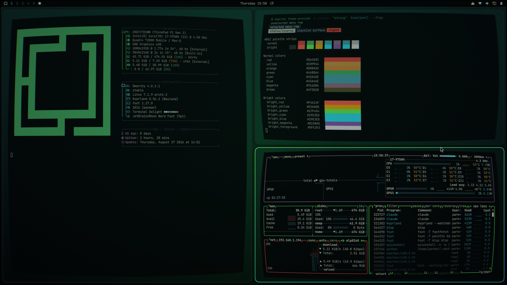
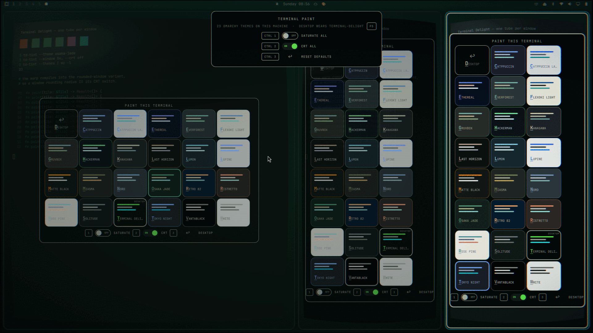
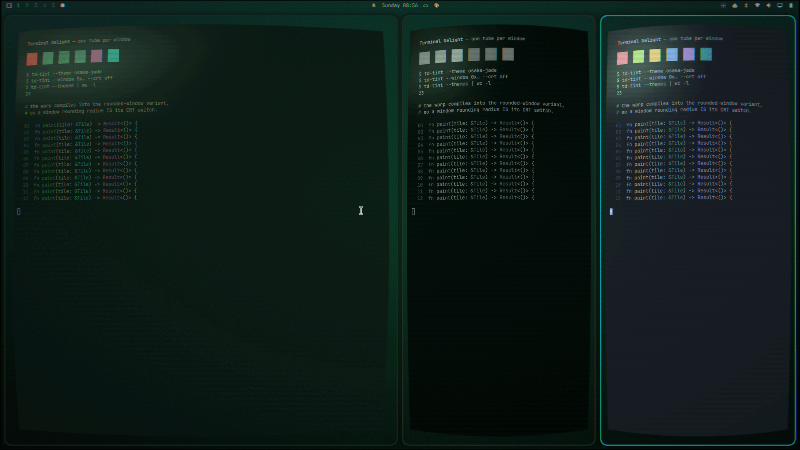
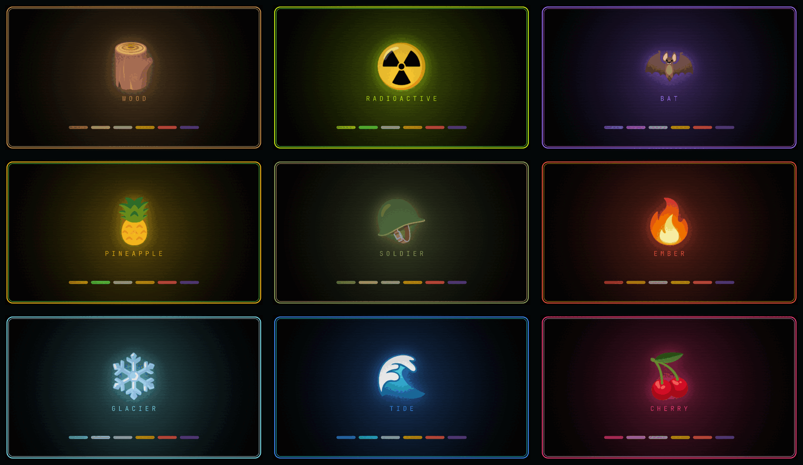

# Terminal Delight — an Omarchy theme

Phosphor green on void black, and every window bowed like the face of a tube.

Sampled from the [Terminal Delight](https://github.com/parker-brown-family/terminal-delight)
terminal's own brand palette, with the same barrel warp the app uses on its
panes — `f = 1 + 0.14·r² + 0.06·r⁴` — lifted to the compositor so it bends
every window, not just one app's.



**Paint every terminal its own identity.** The 🎨 workspace picker floats a
card over each tile holding every Omarchy theme on the machine; one click
paints that tile — palette, border and all — and two switches beside it crank
the text to a phosphor glow or take the tile's tube away:





That picker is a separate, optional install —
[**Terminal Paint**](https://github.com/parker-brown-family/omarchy-td-palette),
a bar widget on the Omarchy plugin marketplace. It paints with the *desktop's*
vocabulary rather than ours, because Omarchy's theme set is larger and is
already the one you chose your desktop from. This repo is the engine
underneath — `td-tint` — plus the eleven hand-made palettes it can also wear
from a prompt. Everything below works from the command line without the
picker.

```bash
omarchy plugin add https://github.com/parker-brown-family/omarchy-td-palette.git --enable
```

## Install

```
Omarchy menu (Super + Space) → Install → Style → Theme
https://github.com/parker-brown-family/omarchy-terminal-delight-theme
```

The same thing from a shell, which is the form `test/install-e2e` exercises:

```bash
omarchy theme install https://github.com/parker-brown-family/omarchy-terminal-delight-theme
```

That gets you the colours, the background, and the full-screen glass. It does
not get you the curve — read on.

Either path clones into `~/.config/omarchy/themes/terminal-delight` (replacing
whatever is already there, so don't run it on a machine where you hand-wrote
that directory) and then stages the theme. Omarchy will not stage a `.lua` or a
terminal config out of an installed theme, because those name programs to run —
this theme ships neither, so nothing of it is dropped. What lands staged is
`colors.toml`, `backgrounds/`, `preview.png`, `crt-glass.frag` and
`icons.theme`. The repo's `bin/`, `test/`, `docs/` and `previews/` are copied
along with them and never run; they are why the staged directory is a few MB
rather than a few dozen KB.

## The curve is a second step, on purpose

Omarchy keeps everything in an installed theme that is colour and drops
anything that would run code on your machine: any `.lua`, the terminal
configs, `vscode.json`. That is a good rule, and this theme runs headlong into
it, because the curve lives in exactly the file it drops.

Two pieces make a window look like glass:

| Piece | Where it comes from | Survives `theme install`? |
|---|---|---|
| Per-window barrel warp | `shaders/{surface,ext}.frag` | goes to `~/.config/hypr/shaders/`, never the theme dir |
| Rounding, squircle, blur, screen shader | Lua — and Omarchy drops Lua from any theme installed from a repo | **no** |

This repo therefore ships no `hyprland.lua` of its own. It would be dead
weight: Omarchy strips it on install and regenerates the colour half from
`colors.toml`, so the file could only ever mislead someone reading the repo
into thinking it took effect. The two places Lua genuinely *does* survive are
both still covered — a **generated variant** gets its own (see
[Why the variants are built, not shipped](#why-the-variants-are-built-not-shipped)),
and everyone else gets the same settings from `install-curve.sh`.

So the curve ships as a script you run yourself, after you have read it:

```bash
git clone https://github.com/parker-brown-family/omarchy-terminal-delight-theme
cd omarchy-terminal-delight-theme
./install-curve.sh          # then log out and back in
```

It copies the two shaders into `~/.config/hypr/shaders/` and writes one marked
block into your `~/.config/hypr/looknfeel.lua` — the rounding and blur the warp
is drawn for. Both are reversed by `./install-curve.sh --uninstall`.

**Log out and back in.** Hyprland reads its shaders once at startup
(`m_shadersInitialized`, 0.56); editing them on a running session does nothing.

## The monitor has knobs

The glass is not a fixed effect any more — it is Terminal Delight's own
display stack, ported dial for dial from the terminal (`app/src/crt.rs` and
its CRT render pass): scanlines with the phosphor tint line, the 160px
tracking band that sweeps down and rests, the occasional stepped flicker
burst, the glass glare hotspot with its diagonal streak, centre phosphor
bloom, vignette — and a monitor-OSD grade (brightness / contrast /
saturation / gamma) applied last, exactly the order the terminal grades its
own tube. Each variant's glass glows in its own hue: the phosphor, scanline
tint, tracking band and glare are retinted per variant by `bin/build-variants`.

Every dial is a `const` at the top of `crt-glass.frag` — the MONITOR CONFIG
block is the config surface — and `td-monitor` turns them without a relogin:

```bash
td-monitor                       # what every knob is set to
td-monitor set TRACKING 0.8      # a hotter roll bar
td-monitor set FLICKER 0 SCAN 0.1   # calm it down
td-monitor off                   # lift the glass entirely
td-monitor reset                 # pristine defaults
```

A `set` is validated with `glslangValidator` before it touches the live
compositor, applied across the whole installed family (a monitor setting is
not a per-colourway thing), and recompiled in place. Hand-editing the block
works exactly as well — the tool is a convenience, not a gate.

**The glare lives on the tiles.** Each window's glass glare (the hotspot +
diagonal streak) ships in the per-window warp shaders — `install-curve.sh`,
relogin to arm — so every tile catches the room light like a Terminal Delight
pane, and Terminal Delight's own windows (which draw their own glass) are
excluded by their rounding-0 rule. The monitor pass's `GLARE` knob is the
WHOLE-SCREEN version and defaults to 0; without the curve installed, raise it
(`td-monitor set GLARE 0.42`) for one big sheet of glass instead.

**Motion is opt-in.** Hyprland treats any screen shader that declares a
`time` uniform as animated and turns damage tracking off for it — its own
warning says the quiet part: the whole screen redraws every frame. So the
glass ships STILL (`ANIMATED 0`): no clock, no warning, no cost — scanlines,
glare, bloom and grade are all static effects. Turning any motion knob
(`TRACKING`, `FLICKER`, `JIGGLE`) above zero raises `ANIMATED` for you, and
zeroing all three drops it again; `td-monitor set ANIMATED 1` forces it. The
tracking band earns its GPU bill — decide per moment, not per install.

## What the warp does, and what it costs


The warp compiles only into the rounded-window shader variant, so it keys off
`rounding > 0`. Windows bow. Layers — the bar, the wallpaper, menus — and
fullscreen windows stay flat.

**That is also the switch.** Because the whole block — warp *and* glare — is
gated on the rounded variant, a window's rounding radius is its CRT power
switch, and `td-tint` exposes it:

```bash
td-tint --crt off                       # this terminal, flat glass
td-tint --window 0x… --crt toggle       # or somebody else's
```

It is worth being clear about why it is rounding and not something more
obvious. Hyprland reads window shaders **once, at startup**, so the shader
itself cannot be swapped while you are looking at it. The screen shader *can*
be swapped live, but doing so wedges `wlr-screencopy` for hours — screenshots
hang, and `hyprctl reload` does not clear it. Rounding is the one property in
this whole stack that the compositor honours live, per window, and that the
shader already keys off. So it is the lever, and there is no second one.

An unswitched window inherits the desktop's rounding, and that is a state of
its own — distinct from "switched on". `set_prop` has no working unset, so
`td-tint --sync` re-pins only tiles that asked, and leaves the rest inheriting.

Three things worth knowing before you install it:

- **It is compositor-wide, not theme-scoped.** Those two shaders sit in your
  Hyprland config, not in the theme, so they keep bending windows after you
  switch to another theme — as long as that theme has rounding. Any theme with
  `rounding = 0` is unaffected on its own. Remove the warp with
  `--uninstall`.
- **Hit-testing stays flat.** Near a window's edge the visible content sits up
  to about 2% of the window's size inward of where your cursor actually
  clicks. Middles are fine; corners of a tightly-packed UI are not. Turn
  `TD_K1`/`TD_K2` down in `shaders/surface.frag` if it bothers you.
- **Terminal Delight itself is exempt.** The app warps its own panes, so the
  theme pins its window class to `rounding = 0` — otherwise it gets bent
  twice.

## Eleven terminals you can tell apart



A wall of terminals that all look the same is a wall of terminals you have to
read to navigate. So the theme ships a set of **palettes**: one glyph, one hue,
one identity each.

```bash
./install-variants.sh
```

Then paint the workspace — one card over every terminal tile:

```
Super + Alt + P          Terminal Paint
td-tint cherry           …or just this terminal, from a prompt
```

| | Palette | Reads as |
|---|---|---|
| 🪵 | wood | warm oak, the quiet one |
| ☢️ | nuclear | the mid-century atomic board: trefoil yellow to teal |
| 🦇 | violet | violet dusk |
| 🍍 | pineapple | gold with a green leaf |
| 🪖 | army | olive drab, muted on purpose |
| 🔥 | ember | forge red |
| ❄️ | glacier | ice cyan |
| 🌊 | tide | deep cobalt |
| 🍒 | cherry | rose crimson |
| 🌆 | retro | neon skyline, magenta to cyan |
| 🦡 | badger | strict equal-RGB greyscale |

Remove them again with `./install-variants.sh --uninstall`. The base theme is
left alone.

### A palette is not a theme

The palettes live in `~/.local/share/terminal-delight/palettes/`, not in
Omarchy's theme directory, and that is deliberate.

Omarchy's theme grid answers one question: *what does this desktop look like?*
Eleven Terminal Delight entries in it are eleven wrong answers — you scroll
past ten near-identical thumbnails to reach the theme you actually meant, and
picking one repaints the whole desktop when what you wanted was to tell one
terminal from the next. So the grid carries **exactly one** Terminal Delight,
and the eleven identities live where they belong: in the painter, aimed at a
tile.

If you do want a variant as the whole desktop, the full theme form is still
there — colours, `hyprland.lua`, the retinted monitor pass, a tinted
background and a gallery tile:

```bash
./bin/build-variants --as-themes --only tide
```

An install from before this move had all eleven in the grid; the build retires
those directories on the way past (only ones it generated, and it switches the
desktop to the base theme first if you happen to be wearing one).

### The second source: Omarchy's own themes

The palettes are eleven answers. The box already has twenty-odd more, and
there is no reason a single tile cannot wear one:

```bash
td-tint --theme osaka-jade      # this terminal, in Omarchy's Osaka Jade
td-tint --themes                # what's installed
```

It is the same `colors.toml`, down the same tty, through the same OSC — the
only difference is which list the name came from, which is why `--theme`
carries its own name rather than leaving it positional.

[Terminal Paint](https://github.com/parker-brown-family/omarchy-td-palette),
the workspace picker, offers **only** this list: Omarchy's set is larger and
already the vocabulary you chose your desktop from, and Terminal Delight is in
it as one theme, so nothing is out of reach. The palettes stay a command-line
identity — `td-tint cherry` — which is where a hand-made set of eleven earns
its keep.

Nothing is cached. `td-tint --themes` and `td-tint --state` glob the theme
directories at the moment you call them, so a theme installed a minute ago is
in the list and one uninstalled a minute ago is not:

```bash
$ td-tint --themes | wc -l
23
$ mkdir -p ~/.config/omarchy/themes/borrowed && cp …/colors.toml $_
$ td-tint --themes | wc -l
24
```

### The config surface is one file

[`variants.toml`](variants.toml) is the whole thing. Six keys per variant —
glyph, accent, accent_bright, foreground, background, surface — and
`bin/build-variants` derives the rest: the full 26-key palette, the foreground
ramp, the background steps, the window border gradient, the tinted wallpaper
and the tile.

```toml
[cherry]
glyph         = "🍒"
accent        = "#F43C7A"
accent_bright = "#F49CC8"
foreground    = "#C7A9B4"
background    = "#0A0407"
surface       = "#220C16"
```

Copy a block, change the colours, re-run the installer. There is no colour
wheel and no live editor, because the thing editing this is usually an agent,
and an agent would rather write six hex values than drag a pip.

The semantic ANSI colours — red, yellow, orange, magenta — are inherited from
the base in every variant, so code stays readable wherever you are. The slots
Terminal Delight uses as its signature pair, the greens and cyans, are where
the variant's hue lands. That is the part you see without looking.

### One terminal at a time — `td-tint`

An Omarchy theme is global by design. Switching it repaints every terminal at
once, which is the exact opposite of being able to tell them apart. So the
variants come with a second, smaller tool that changes **one terminal and
nothing else**:

```bash
td-tint                        # pick from the palette set
td-tint cherry                 # this terminal is now the cherry one
td-tint --theme osaka-jade     # …or one of Omarchy's own themes
td-tint --crt off              # flat glass, this terminal only
td-tint --clear                # back to whatever the desktop theme says
```

It writes that variant's OSC palette down the terminal's own tty, and sets
the border colour as a property on that terminal's own window. Both are
runtime-only: nothing is written to disk, there is no state to clean up, and
the tint dies with the window. The desktop theme is never touched, so you can
run a dozen differently-coloured terminals side by side on one theme — text,
ANSI ramp and window border all matching.

The window it recolours is found by walking up `/proc` from the calling shell
until a pid matches a Hyprland client, so it works from inside tmux and from
a script, not only from the shell you are typing in.

Every pick is remembered at `$XDG_RUNTIME_DIR/td-tint/<addr>` (runtime-only,
dies at logout), and a `theme-set.d` hook installed by `install-variants.sh`
runs `td-tint --sync` after every Omarchy theme switch — so recorded picks
keep their identity, everything else adopts the new theme's borders, and no
window is ever left wearing yesterday's colours. Per-window border props
survive switches on their own (Hyprland's `set_prop` has no working unset),
which is exactly why the hook exists.

Terminal Delight itself is not the target here — it renders its own palette
and has a per-pane colour tray for the same job. `td-tint` is for foot,
Alacritty, Ghostty, kitty: anything that honours OSC 4/10/11.

**What the crank can reach.** Paint and SATURATE work by redefining the
terminal's palette, so they recolour every cell that is *drawn from* the
palette: shell prompts, `ls`, compiler output, tmux status lines — the
16-colour world most terminal life lives in. A TUI that paints in 24-bit
RGB (anything seeing `COLORTERM=truecolor` — Claude Code, modern editors,
tmux configured with `*:RGB` passthrough) carries its colours per-cell and
never consults the palette, so those pixels keep their app-chosen colour by
design. You can watch the boundary in a single tile: saturate a tmux pane
running a truecolor agent and the status bar takes the crank while the
agent's prose does not. For per-pane grading that reaches *every* pixel,
that is what adopting the pane into Terminal Delight is for — TD grades at
the renderer, below the colour encoding.

### The whole workspace at once

[Terminal Paint](https://github.com/parker-brown-family/omarchy-td-palette) is
the picker: one card over every terminal tile, holding every theme this machine
has, with SATURATE and CRT switches per tile and SATURATE ALL / CRT ALL on the
rail. It renders `td-tint --state` and shells back to `td-tint` to act — it
authors no colours and installs no shaders. On a box where `install-curve.sh`
has not run, its CRT switches are absent rather than inert, because `--state`
reports `crt.available` and a control that cannot do anything is worse than no
control.

### Why the variants are built, not shipped

Generating them on your machine keeps the repo small, but the real reason is
what it buys under `--as-themes`: `omarchy-theme-set` only strips Lua from a
theme carrying its own `.git` (`omarchy-theme-set:207`). A variant theme
generated on your machine has none — so it keeps its `hyprland.lua`, and the
rounding, blur and screen shader come with it. **A variant built as a theme is
curved out of the box.** Only the per-window warp is still a separate step,
because those shaders live in Hyprland's config rather than in any theme:

```bash
./install-curve.sh    # once; it reloads Hyprland for you
```

Hyprland loads window shaders when it reads its config, so `hyprctl reload`
arms them — a relogin is not needed, whatever the docs imply. Verified by
pixel on 0.56: install, reload, and the windows bow on the next frame.

## The three repos

| Repo | What it is |
|---|---|
| [**terminal-delight**](https://github.com/parker-brown-family/terminal-delight) | the terminal itself — GPU-native, Rust, tiling panes, per-pane grading |
| [**omarchy-terminal-delight-theme**](https://github.com/parker-brown-family/omarchy-terminal-delight-theme) | the desktop half — the Omarchy theme, the palette set, the compositor curve, and `td-tint` |
| [**omarchy-td-palette**](https://github.com/parker-brown-family/omarchy-td-palette) | *Terminal Paint* — the 🎨 bar widget that raises the picker over every terminal tile on the workspace |

This one is the middle layer, and the only one the other two both depend on:
`install-variants.sh` is what puts `td-tint` on `PATH`, and `td-tint --state`
is the oracle the palette widget renders — both card lists, the tiles, and
which list each tile's pick came from. A palette key written in
`variants.toml` becomes a card in that widget — which is why the widget
validates every key it reads rather than trusting this repo to be careful.

## Files

| File | What |
|---|---|
| `colors.toml` | the palette every Omarchy template is generated from |
| `backgrounds/` | Void Tube |
| `crt-glass.frag` | the MONITOR pass — Terminal Delight's display stack for the whole desktop: px-true scanlines, the rolling tracking band, stepped flicker, glass glare, phosphor bloom, vignette, and a brightness/contrast/saturation/gamma grade. Every dial is a `const` in its MONITOR CONFIG block; `CURV = 0` because the per-window warp carries the curve |
| `shaders/surface.frag`, `shaders/ext.frag` | the per-window warp |
| `install-curve.sh` | the opt-in installer for what the drop takes away: the per-window shaders, plus a managed rounding/blur/shadow/screen-shader block in `~/.config/hypr/looknfeel.lua`. It is also what arms the per-tile CRT switch, because that switch is the rounded-variant gate |
| `variants.toml` | the palette set: six keys each, the only file you edit |
| `bin/build-variants` | derives a palette from those six keys — or, under `--as-themes`, a whole theme and its gallery tile |
| `bin/td-tint` | tint one terminal — text, border and tube — from either source, without touching the theme |
| `bin/td-monitor` | turn the monitor's knobs — rewrite the CONFIG block across the installed family, validate, recompile live |
| `bin/td-mcp` | the paint surface as MCP tools for agents — see "Agents paint too" |
| `test/run` | the hermetic test suite (stubs for hyprctl/omarchy-theme-*; no compositor needed) |
| `install-variants.sh` | builds every palette into `~/.local/share/terminal-delight/palettes/`, installs the tools, and retires the old variant *themes* |
| `previews/` | the gallery tiles, as the theme grid shows them under `--as-themes` |

Copying the directory into `~/.config/omarchy/themes/terminal-delight/`
yourself keeps all of it — a theme you wrote stays yours — but the curve still
arrives through `install-curve.sh`, which writes its managed block into
`~/.config/hypr/looknfeel.lua`. It skips that step, and says so, if the staged
theme already carries Lua of its own; a generated variant does.

## Agents paint too

`bin/td-mcp` is the whole surface as an MCP server — stdlib Python, stdio,
register it once:

```bash
claude mcp add td-paint -- ~/.local/bin/td-mcp
```

Tools: `list_variants` and `list_themes` (both card lists, read live),
`list_tiles` and `state` (every terminal window with its pick, source,
saturation and tube), `paint` and `paint_theme`, `crt`, `saturate`,
`border_only`, `clear`, `sync`, `paint_panes` (Terminal Delight's per-pane
picker over its control socket), `monitor_knobs`, `monitor_set`.

Deliberately thin: every tool delegates to the same CLI a human runs, so there
is one behaviour and the MCP layer cannot drift from it. That is a rule with
teeth — the façade had fallen a release behind the engine, and an agent that
cannot reach `--theme` or `--crt` is a façade with holes in it.

## Tests

```bash
./test/run
```

Dependency-free and hermetic: `XDG_*` point into a throwaway tree and
hyprctl / omarchy-theme-color / omarchy-theme-osc / glslangValidator /
terminal-delight are logging stubs on `PATH`, so the suite asserts against
files and call logs, never your live compositor. CI (GitHub Actions) runs
the suite, shellcheck at warning level, `td-mcp` byte-compilation, and
compiles every generated frag in BOTH `ANIMATED` states.

Three more read the real machine, so they are not part of `test/run` and not
part of CI — they are evidence about the box they ran on, on the day they ran:

```bash
./test/install-e2e         # a clean install, from clone to staged theme
./test/probe-cube-demand   # does anything here paint through the 256 cube?
./test/verify-cube-live    # does a cube slot actually move in a real terminal?
```

`install-e2e` runs the genuine `omarchy-theme-install` and `omarchy-theme-set`
with `HOME` and every `XDG_*` pointed at a throwaway tree, so it exercises the
real clone, the real name derivation and the real staging deny list without
going anywhere near your installed theme — which matters, because that install
path begins by deleting it. `verify-cube-live` opens a foot window for about a
second and asks it, over OSC 4, what colour it is actually holding.

## Light mode

There isn't one. It is a tube.

## Licence

MIT.
